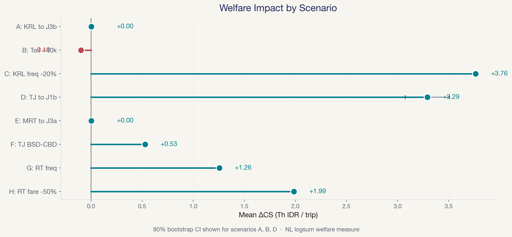
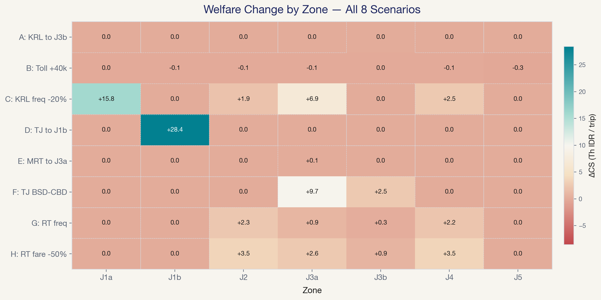

<!-- _class: lead -->

# Mode Choice and Policy Welfare  in Jabodetabek
## An MNL → NL → MXL Comparison

**Dhaneswaramandrasa**
Hiroshima University · Transportation Engineering AY2026
June 3, 2026 · Session L15

---

## Motivation

- Jabodetabek: 30M+ population, 3.5M daily commuters — car/moto-dominated
- Transit expansion is spatially uneven: J1b (Parung) and J3b (Gading Serpong) have **no formal transit** at all
- **Which policies maximize welfare? How are gains distributed?**

Research framework: 6-mode choice set → MNL/NL/MXL → AIC/LR/Wald → best model → logsum ΔCS → 8 policy scenarios A–H

Data: 5,000 synthetic persons (NL GEV DGP, λ=0.70) + real r5py GTFS transit LOS + Ilahi et al. (2021) β anchors

---

## Study Area & Data

| Feature | Detail |
|---------|--------|
| Zones (7) | J1a–J5, Bodetabek → Jakarta CBD |
| Modes (6) | Car, Motorcycle, KRL, TransJakarta, RoyalTrans, MRT |
| Nest structure | Transit {KRL, MRT, TJ, Royal} · Private {Car, Moto} |
| Population | 5,000 synthetic; 3 income segments (BPS Susenas 2023) |
| Transit LOS | r5py GTFS routing (AM peak 07:00–09:00, fallback 180 min) |
| Private LOS | BPR free-flow speeds (toll 80, arterial 40, local 25 km/h) |
| DGP | NL GEV closed-form choice generation, μ=25 scale normalization |

β_time,m derived from Ilahi (2021) Table 11 mode-specific VTTS via β_time = β_cost · VTTS / 60,000. β_cost = −1.42 (Ilahi Table 10). VOT preserved exactly under scale normalization (Train 2009 §3.7).

---

## MNL: Specification & IIA Problem

$V_{mn} = ASC_m + \beta_{\text{time},m} \cdot T_{zn} + \beta_{\text{cost}} \cdot C_{zn}$

12 parameters · L-BFGS-B MLE · KRL = reference alternative

| Result | Value |
|--------|-------|
| Parameter recovery | **12/12 within 2 SE** |
| ρ² / AIC | 0.280 / 10,121.65 |

**IIA is violated.** Red-bus/blue-bus: clone KRL as "KRL Express" → MNL nearly doubles transit share (11.7% → 21.8%). NL cross-elasticity: TJ +0.1 utility → transit nest loses 1.90 pp, private nest loses 1.14 pp — within-nest substitution **1.67×** cross-nest. MNL forces equal proportional substitution. NL relaxes it.

---

## Nested Logit: λ̂ = 0.763

Two nests · 13 parameters · FIML via L-BFGS-B

$P_n(m) = P_n(m | k) \cdot P_n(k), \quad P_n(k) = \exp(\lambda I_{kn}) / \sum_\ell \exp(\lambda I_{\ell n})$

| Parameter | Estimate |
|-----------|----------|
| **λ̂** | **0.763 ± 0.068** |
| 95% CI | [0.627, 0.900] — excludes 1.0 |
| LR test vs MNL | χ² = 8.57, df = 1, **p = 0.003** |
| Recovery | 13/13 within 2 SE |
| AIC / BIC | 10,115.08 / 10,199.80 |

**λ=1 is rejected at p<0.01.** Transit modes share unobserved attributes (crowding, schedule coordination, station environment) that make them closer substitutes than IIA allows.

---

## Mixed Logit: σ̂ = 0.010 (n.s.)

Random β_cost ~ N(μ, σ) · R = 100 Halton draws (base=2)

H₀: σ_cost = 0 — any heterogeneity beyond NL nest correlation?

| Parameter | Estimate | SE |
|-----------|----------|-----|
| σ_cost | **0.010** | 0.033 |
| μ_cost | −0.037 | 0.183 |

Wald: W = 0.091, **p = 0.763** → fail to reject H₀

**Positive control**: Mixed-DGP (σ_true=0.02) → Wald p ≈ 0 ✓ (estimator works)

**Finding**: No taste heterogeneity signal. MXL LL (−5,048.79) ≈ MNL LL (−5,048.83). Adding random β_cost gains 0.03 log-likelihood units over MNL — negligible. NL captures the departure from IIA that matters.

---

## Model Selection

| Criterion | MNL | **NL** | MXL |
|-----------|-----|---------|------|
| K | 12 | 13 | 13 |
| LL(β̂) | −5,048.83 | **−5,044.54** | −5,048.79 |
| AIC | 10,121.65 | **10,115.08** | 10,123.59 |
| BIC | 10,199.86 | 10,199.80 | 10,208.31 |
| LR vs MNL (p) | — | **0.003** | 0.799 |
| Wald σ=0 (p) | — | — | 0.763 |

NL beats MNL by ΔAIC = −6.6; beats MXL by ΔAIC = −8.5. LR rejects IIA at p<0.01. Wald fails to reject σ=0. **NL selected** as the parsimonious correct specification → `best_model.json`.

---

## Logsum Welfare Measurement

$$EMU_n = \ln \sum_k \exp(\lambda \cdot I_{kn}), \quad I_{kn} = \ln \sum_{j \in k} \exp(V_{jn} / \lambda)$$

$$CS_n = \frac{EMU_n}{|\beta_{\text{cost}}|}, \quad \Delta CS_n = \frac{EMU_n^{\text{policy}} - EMU_n^{\text{baseline}}}{|\beta_{\text{cost}}|}$$

$$\Delta W_{\text{annual}} = \sum_n \Delta CS_n \times 250$$

**Baseline CS**: −53.65 Th IDR/trip (P10: −115.30, P90: −9.48)
β_cost = −0.077 (SE = 0.097) · Bootstrap CIs use truncated-Normal draws (upper bound = −0.3·|β̂|)

---

## Policy Scenarios — Overview

Top 3 by ΔCS: **C** (KRL freq, +3.76) > **D** (TJ→J1b, +3.29) > **H** (RoyalTrans fare, +1.99)
Most pro-equity: D (+3.38 low vs +3.03 high) · **F** TJ BSD→CBD
Regressive: **B** toll (−0.10, 0 winners) · **G** RoyalTrans freq (served zones only)

---

## Policy Scenarios — Distributional Impact

**Sc C** maximizes aggregate welfare but J1b/J3b receive zero. **Sc D** concentrates gains in transit-orphan J1b (+28.43 Th IDR). **Sc F** benefits both J3a (+9.66) and J3b (+2.49) through route restructuring. Budget transit (TJ at Rp 3,500) draws from motorcycles (−10.1 pp in Sc D), not from other transit modes.

---

## Conclusions & Limitations

**Conclusions**:
1. NL is the appropriate model: λ̂=0.763, LR p=0.003, MXL adds no signal (Wald p=0.763)
2. Top aggregate gain: Sc C (KRL freq, +3.76 Th IDR/trip, +6,580 Bn/yr)
3. Most pro-equity: Sc D (TJ→J1b, +3.29) — concentrated in the most underserved zone
4. **Bundle** service quality improvements with network expansion

**Limitations**: Synthetic DGP · Car share ~1% (full economic cost vs perceived marginal cost) · No income-VoT interaction in DGP · Ride-hailing excluded (β non-transferability) · Bootstrap CIs wide (β_cost SE=0.097) · λ̂ +9% upward bias from transit-nest dominance

---

<!-- _class: lead -->

# Thank you
## Questions?

---

## Backup A: Why σ = 25?

Scale identification theorem (Train 2009 §3.7):

True utility: $U = V + \varepsilon$, ε ~ Gumbel(0, μ) → Estimated: $\tilde{U} = \tilde{V} + \tilde{\varepsilon}$, ε̃ ~ Gumbel(0, 1)

Normalization compresses all coefficients: $\tilde{\beta} = \beta / \mu$

**VOT = β_time / β_cost is preserved** — μ cancels. β magnitudes differ from Ilahi's, but the behavioral metric (VOT) recovers exactly.

Without μ=25, utility gaps are too large and choice becomes deterministic (99%+ choosing one mode). With μ=25, β estimates have larger SEs (the tradeoff), but the Gumbel noise produces realistic choice distributions: Moto 36.7%, TJ 34.0%, KRL 17.8%.

---

## Backup B: Why Drop Ride-Hailing & LRT?

| Mode | Reason for exclusion |
|------|---------------------|
| 2WRH (GoRide/GrabBike) | Ilahi β_time_2wrh = −5.10 estimated on short urban trips → near-zero share on 30–105 km commutes. Parameter non-transferability (Wardman et al. 2016). |
| 4WRH (GoCar/GrabCar) | ASC calibration required >+40 utility units to match BPS aggregate share — outside defensible range. |
| LRT Jabodebek | Available in only 1 of 7 zones (J2). Single-zone presence → ASC absorbs zone unobservables, not mode preference. |

Nine-mode DGP tested → six-mode adopted. Documented in report §2.2, §6.3.

---

## Backup C: Why Car Share ~1%?

LOS skim uses **full economic cost**: toll + fuel + parking ≈ Rp 130,000 per trip from outer zones.

Commuters perceive **marginal cost** (fuel ≈ Rp 30,000) once the car is owned — the fixed ownership cost is sunk at trip level.

With β_cost anchored to Ilahi (2021), full-cost specification suppresses Car utility. We keep the conservative specification to preserve the Ilahi anchor rather than introducing an unvalidated cost adjustment.

Result: 51 of 5,000 persons choose Car. β_time,car hits zero bound (true −0.024 within 0.17 SE). A two-stage budgeting model (own then use) would address this — beyond project scope.
